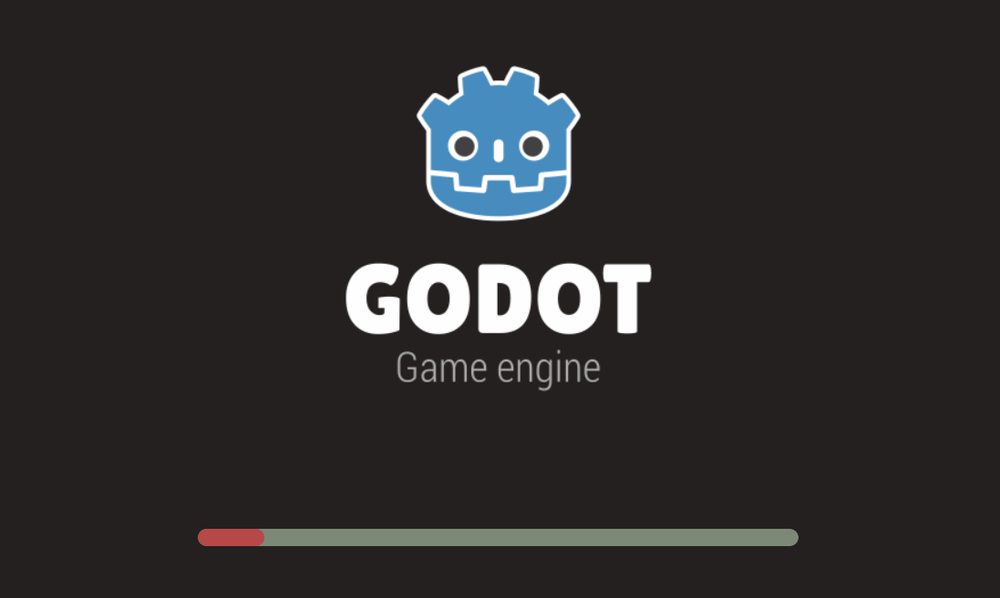

# Custom HTML Loader

This repository contains a custom HTML loader plugin for Godot Engine. The plugin allows you to customize the HTML export template for web builds.

>[!WARNING]  
>This plugin may not work correctly with custom HTML templates.

>[!NOTE]  
>This plugin has been tested on Godot version 4.3.

## Features

- Customize the background color.
- Customize the styles of the progress bar, including width, border radius, and colors.

## Installation

1. Clone this repository into your Godot project's `addons` folder.
2. Enable the plugin in the Godot Editor under `Project > Project Settings > Plugins`.

## Usage

1. Configure the plugin settings in the Godot Editor.
2. Export your project to HTML5.
3. The plugin will automatically modify the exported HTML file to include the custom styles.

## Configuration

The plugin settings can be updated in the Godot Editor. The following settings are available:

- `back_color`: Background color for the status element.
- `loader_back_color`: Background color for the progress bar.
- `loader_progress_color`: Color of the filled part of the progress bar.
- `border_radius`: Border radius for the progress bar.
- `loader_width`: Width of the progress bar.

## Screenshots
### Editor

### Result

## Contributing

Contributions are welcome! Please open an issue or submit a pull request.

## License

This project is licensed under the MIT License.
