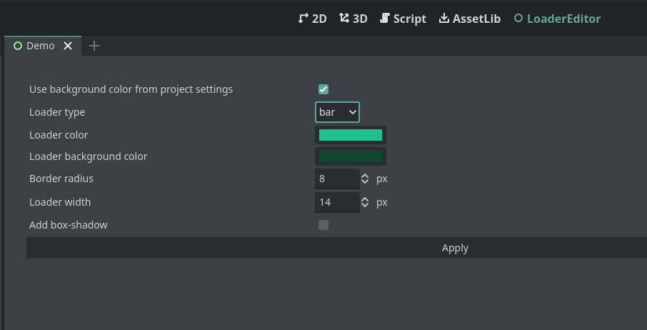

# Custom HTML Loader

This repository contains a custom HTML loader plugin for Godot Engine. The plugin allows you to customize the HTML export template for web builds.

>[!WARNING]  
>This plugin may not work correctly with custom HTML templates.

>[!NOTE]  
>This plugin has been tested on Godot versions 4.3, 4.4.

## Features

- Customize the background color.
- Customize the styles of the progress bar, including width, border radius, and colors.
- Customize the loader type (bar or circle).

## Installation

1. Clone this repository into your Godot project's `addons` folder.
2. Enable the plugin in the Godot Editor under `Project > Project Settings > Plugins`.

## Usage

1. Configure the plugin settings in the Godot Editor.
2. Export your project to HTML5.
3. The plugin will automatically modify the exported HTML file to include the custom styles.

## Configuration

The plugin settings can be updated in the Godot Editor. The following settings are available:

- `is_back_color`: If true, uses the background color from the project settings. If false, you can set your own background color.
- `back_color`: Background color.
- `progress_type`: Type of the loader (bar or circle).
- `loader_back_color`: Background color for the loader (bar or circle).
- `loader_progress_color`: Color of the filled part of the loader (bar or circle).
- `border_radius`: Border radius for the progress bar.
- `loader_width`: Width of the progress bar or circle.
- `is_box_shadow`: If true, applies a box shadow to the loader. 

## Screenshots
### Editor

### Result
 

## Contributing

Contributions are welcome! Please open an issue or submit a pull request.

## License

This project is licensed under the MIT License.
